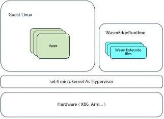

# proj191-seL4-for-wasmedge
 seL4 作为Hypervisor启动一个 WasmEdge 运行时环境

### 项目描述

#### seL4 **与微内核**

   

   seL4 是一个操作系统微内核，它本身不是一个完整的操作系统。它只提供有限的 API，没有提供如传统的操作系统 Linux 那样的内存管理、页内外交换、驱动程序等等。seL4 微内核设计针对实时应用，可潜在应用于强调**安全**和**关键性任务**的领域内，如军用和医疗行业。研究发现常用的攻击方法对 seL4 无效，如恶意程序经常采用的缓存溢出漏洞。

   seL4 是第三代微内核操作系统，基本上可以说是基于 L4 的，它提供了虚拟地址空间

   （virtual address spaces）、线程（threads）、IPC（inter-process communication）。

   seL4 的控制机制是基于 capabilities 的, capabilities 机制提供了访问内核对象（kernel objects）的方法，这种机制使得 seL4 与其它 L4 比起来，显示出一定的高效率。

   seL4 是一个微内核，但它也是一个 Hypervisor：可以在 seL4 上运行虚拟机，在虚拟机

   （VM）中运行主流操作系统，如 Linux。这为提供系统服务提供了另一种实现方式，即借用 Linux 虚拟机提供系统服务。

   

#### WebAssembly 与 WasmEdge

WebAssembly 是一种运行在现代网络浏览器中的新型代码，并且提供新的性能特性和效果。该技术旨在打破传统 Web 行业由 Javascript 等脚本语言带来的性能瓶颈。

WasmEdge（WebAssembly Edge 曾用名 SSVM）是为高性能应用优化的 WebAssembly虚拟机。WasmEdge 是 Linux 基金会旗下 CNCF (云原生计算基金会)的沙箱项目。它是一个代码运行环境，可以添加到已有的应用程序和框架上。开发者可以通过 WasmEdge 运行用户提交的代码来提升和拓展各种应用程序。

WasmEdge 是一个轻量级、高性能、可扩展的 WebAssembly 运行时环境，适用于云本地、边缘和分散的应用程序。它支持无服务器应用、嵌入式功能、微服务、智能合约和物联网设备。

通过 AOT (Ahead of Time compiler) 支持， WasmEdge 已经是市场上最快的

WebAssembly 虚拟机之一。

   
### 所属赛道

2022全国大学生操作系统比赛的“OS功能挑战”赛道

### 参赛要求

- 以小组为单位参赛，最多三人一个小组，且小组成员是来自同一所高校的本科生（2022年春季学期或之后本科毕业的大一~大四的学生）或研究生
- 如学生参加了多个项目，参赛学生选择一个自己参加的项目参与评奖
- 请遵循“2022国大学生操作系统比赛”的章程和技术方案要求

### 难度

中等 ~ 高
等

### 项目导师
李栋 lidong@ict.ac.cn

### 功能描述
#### seL4 As Hypervisor For WasmEdge
   

图  seL4 As Hypervisor For WasmEdge

如上图所示，我们最终实现的目标是，在已知的硬件开发板上（树莓派、Jetson 系列）运行 seL4 微内核，并且将 seL4 作为 Hypervisor，在其上层启动一个（或多个）传统虚拟机与操作系统（如 Linux）以及一个 WasmEdge 运行时环境，各个环境互相隔离或通过可验证的方式通信，同时各个环境运行独立的 Tasks。

#### 具体要求

   
我们需要对该 seL4 As Hypervisor For WasmEdge 方案进行以下几个维度的评估：

1. 执行速度：对比包括但不限于传统的虚拟化方案（Xen、KVM）、沙箱方案（docker、 container）。
2. 安全性：采用形式化验证的方法对其安全性进行验证。
3. 实时性：用户的响应时间。
4. 稳定性：应用的稳定性。

      

#### 技术储备
为了研究 seL4 源码及其运行机制，需要开发者具备扎实的计算机体系结构知识，尤其是对操作系统、计算机组成原理、编译原理、C 语言要求较高，尤其是前两者。

为了使 seL4 达到对 WasmEdge 的支持，需要对 Wasm 有一定的认识，要有汇编语言的基础，同时需要掌握一门或多门编程语言如 Rust、C/C++、Go、Javascript 等函数式编程语言。另外，为了能够将 WasmEdge 的接口暴露给 seL4，需要开发者具备良好的接口设计技巧与编程范式。

#### 具体内容

根据方案涉及到的技术点，工作内容如下：

1. 基于 seL4 项目，对选型的 arm 开发板移植 seL4+WasmEdge。 
2. 利用形式化验证方法，对研发出的框架进行测试与验证。
      

#### 时间初步规划

      
表 4-1 研发任务的初步规划

      

| 月数                                                         | 阶段 | 详情                                                         |
| ------------------------------------------------------------ | ---- | ------------------------------------------------------------ |
| 1                                                            | 入门 | 1.a 确定硬件选型：建议参考官方团队已经支持的部分开发板，并在网络上进行购买，参见 https://docs.sel4.systems/Hardware/ |
| **1.b** 熟悉 seL4 的运行机制，包括其外围众多基于 seL4 的 project（参见https://docs.sel4.systems/projects/，重要的项目：seL4test, Camkes, camkes- arm-vmm, tutorials ） ， 建 议 一 定 要 把 官 方 教 程（https://docs.sel4.systems/Tutorials/ ）操作一遍。 |      |                                                              |
| **1.c** 在开发板上实践重要的项目，seL4test、camkes-arm-vmm   |      |                                                              |
| **1.d** 学习使用 wasm，将代码嵌入到 web 等平台。对 wasmedge 的设计要有初步了解。 |      |                                                              |
| 2                                                            | 重构 | 2.a 迭代【入门】遇到的问题，最终目标与当前研究的路线进行对比修改。 |
| 2.b 对【入门】遇到的缺失的基础知识（操作系统、组成原理、编译原理等）进行针对性的补充学习。 |      |                                                              |
| **2.c** 开始着手使用 Camkes 等组件描述语言进行框架的开发或对已有的项目 进 行 改 进 ， 如 camkes-arm-vmm （ 参 见https://docs.sel4.systems/projects/camkes-arm-vm/ ）。 |      |                                                              |
| 3                                                            | 研发 | **3.a** 研发主体虚拟化框架，对 wasmedge 进行接口的补充。     |
| 4                                                            | 实践 | 4.a 对框架在开发板上进行测试与工程实践。                     |
| 5                                                            | 验证 | 5.a 利用形式化方法，对框架进行验证与迭代。                   |
| **5.b** 进行全部代码的 Debug。                               |      |                                                              |

      

参见上表，是对该项目的初步时间安排（按月份）：

 1、 第一个月：【入门】

      1. 确定硬件选型：建议参考官方团队已经支持的部分开发板，并在网络上进行购买，参见https://docs.sel4.systems/Hardware/
      2. 熟悉 seL4 的运行机制，包括其外围众多基于 seL4 的 project [（ 参见 ](https://docs.sel4.systems/projects/)[https://docs.sel4.systems/projects](https://docs.sel4.systems/projects/)/，重要的项目：seL4test, Camkes, camkes-arm- vmm, tutorials[），建议一定要把官方教程（](https://docs.sel4.systems/Tutorials/)[https://docs.sel4.systems/Tutorials](https://docs.sel4.systems/Tutorials/)/ ）操作一遍。
      3. 在开发板上实践重要的项目，seL4test、camkes-arm-vmm
      4. 学习使用 wasm，将代码嵌入到 web 等平台。对 wasmedge 的设计要有初步了解。

2、 第二个月：【重构】

1. 迭代【入门】遇到的问题，最终目标与当前研究的路线进行对比修改。
2. 对【入门】遇到的缺失的基础知识（操作系统、组成原理、编译原理等）进行针对性的补充学习。
3. 开始着手使用Camkes 等组件描述语言进行框架的开发或对已有的项目进行改进，如 camkes-arm-vmm（参见https://docs.sel4.systems/projects/camkes-arm-vm/ ）。

3、 第三个月：【研发】

a) 研发主体虚拟化框架，对 wasmedge 进行接口的补充。

4、 扩展内容：【测试与实践】

a) 对框架在开发板上进行测试与工程实践。

5、 扩展内容：【验证】

1. 利用形式化方法，对框架进行验证与迭代。
2. Debug。

### 前进展

经过初步的了解与实践，当前的实践成果与进展如下：

1. 在 Raspberry 4B 8GB 上移植了 seL4test； 
2. 在 Nvidia Jetson TX1 上移植了 seL4test；
3. 在 Nvidia Jetson TX1 上移植了 camkes-arm-vmm;

### 参考文档

1. seL4 主页.https://sel4.systems/
2. seL4 及相关 github 仓库.https://github.com/seL4
3. seL4 白皮书 pdf.http://sel4.systems/About/seL4-whitepaper.pdf
4. seL4 及基于 seL4 开发 system 的官方实践教程.https://docs.sel4.systems/Tutorials/
5. seL4 官方开发的 arm 板支持情况.https://docs.sel4.systems/Hardware/
6. 基于 seL4 的 arm 虚拟化框架，同时该页包含了所有基于 seL4 开发的系统项目.https://docs.sel4.systems/projects/camkes-arm-vm/
7. Raspberry 4B 实践 seL4test.https://docs.sel4.systems/Hardware/Rpi4.html
8. Nvidia Jetson TX1 实践 seL4test.https://docs.sel4.systems/Hardware/jetsontx1.html
9. Nvidia Jetson TX2 实践 seL4test.https://docs.sel4.systems/Hardware/JetsonTX2.html
10. WebAssembly 主页.https://webassembly.org/
11. WasmEdge 仓库.https://github.com/WasmEdge/WasmEdge
12. 一个基于 seL4+WasmEdge 的仓库，可作为参考 Project.https://github.com/second-[state/wasmedge-seL4](https://github.com/second-state/wasmedge-seL4)
